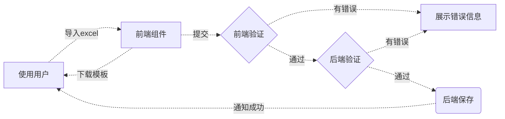

# ExcelImport 导入

Excel 导入是管理系统最常用功能之一，在之前的工作中深感各种导入实现的繁琐，对于开发同学的心智负担太大，所以编写了此通用的导入组件。

组件功能特点：

1. 开发者仅需定义列验证规则，无需关注其他任何工作细节，验证规则参考 ^link(Validate 数据验证)
2. 自带模板导出功能，无需编写下载模板的逻辑，也不用保存模板文件，模板由组件内部动态生成。
3. 支持多行标题的excel导入。
4. 支持导入前验证模板是否匹配。
5. excel文件自动解析，无需编写任何解析逻辑。
6. 验证规则会在excel导出的模板中体现。
7. 内置导入时验证错误信息的展示。
8. 支持服务器端数据验证，并展示验证错误信息。
9. 支持错误信息的导出。

## 工作流程

在使用前我们先了解一下导入组件的工作流程

## 基础用法

:::demo
components/excel-import/basic
:::

## tip提示文字

:::demo
components/excel-import/tip
:::

## 复杂用法

:::demo
components/excel-import/complex
:::

## 嵌入式用法

有时候我们不需要显示预览数据，而是选择完文件后直接导入
:::demo
components/excel-import/embedded
:::

## ExcelImport API

### ExcelImport 属性

| 属性名                           | 描述                                                     | 类型                                                                                          | 默认值              |
|-------------------------------|--------------------------------------------------------|---------------------------------------------------------------------------------------------|------------------|
| columns                       | excel列定义 [ImportExcelColumn](#importexcelcolumn-类型) [] | ^[object]`ImportExcelColumn []`                                                             | 必填               |
| template-file-name            | 下载导出模板文件名称                                             | ^[string]                                                                                   | `'导入模板'`         |
| layout                        | 表格布局方式                                                 | ^['auto' \| 'stretch']                                                                      | `'auto'`         |
| on-complete                   | 前端验证通过数据的回调方法，如果是异步操作，请返回Promise对象                     | ^[Function]`(data: T[]) => Promise<ExcelError[] \| undefined> \| ExcelError[] \| undefined` | 必填               |
| init-data                     | 下载模板的初始化数据                                             | ^[ExcelImportInitData]` T[] \| (() => (T[] \| Promise<T[]>)) \| Promise<T[]>`               | —                |
| show-hint                     | 显示提示信息                                                 | ^[boolean]                                                                                  | `true`           |
| embedded                      | 嵌入式的                                                   | ^[boolean]                                                                                  | `false`          |
| download-template-button-name | 下载模板按钮名称                                               | ^[string]                                                                                   | `'下载模板'`         |
| select-file-button-name       | 选择文件按钮名称                                               | ^[string]                                                                                   | `'选择文件' \| '导入'` |

### ExcelImport Slots

| 插槽名 | 详情     | 类型 |
|-----|--------|----|
| tip | 备注信息插槽 | —  |

### ExcelImport Exposes

| 方法名               | 详情     | 类型                                            |
|-------------------|--------|-----------------------------------------------|
| download-template | 下载模板文件 | ^[Function]`() => void`                       |
| valid-data        | 验证表格数据 | ^[Function]`() => Promise<ValidResult<T> []>` |
| sub-import        | 确认导入   | ^[Function]`() => void`                       |
| export-error      | 导出错误信息 | ^[Function]`() => void`                       |

### ImportExcelColumn 类型

| 属性名      | 描述                           | 类型                                       | 默认值   |
|----------|------------------------------|------------------------------------------|-------|
| prop     | 字段名                          | ^[string]                                | 必填    |
| label    | 列名称                          | ^[string]                                | 必填    |
| rules    | 验证规则，参考 ^link(Validate 数据验证) | ^[ValidRules]`ValidRule \| ValidRule []` | —     |
| hidden   | 此列隐藏                         | ^[boolean]                               | false |
| note     | 列备注                          | ^[string]                                | —     |
| children | 子项                           | ^[object]` ImportExcelColumn []`         | —     |
