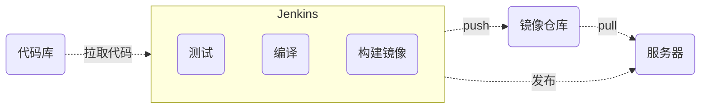

<script setup>
const previewSrcList = ["/image/img_3.png", "/image/img_4.png", "/image/img_5.png", "/image/img_6.png", "/image/img_7.png"];
</script>
# 部署微服务
当我们在开发完程序代码后，就需要将程序部署到服务器，不管是演示环境还是生产环境，程序部署都有一个共同的特点：
那就不断的提交测试，重复的发布，如果每次都是人为发布，这种重复没有意义的工作不仅浪费时间，影响效率，严重的话，还会让发布人员
心生烦躁，耐心尽失，甚至导致他们删库跑路。

Jenkins是一个开放源代码软件，意味着任何人都可以查看它的源代码、对其进行修改和贡献。开源使得Jenkins能够免费提供，并确保其长期的发展和维护。
Jenkins为开发团队提供了一个平台，使其能够自动化各种任务，例如代码构建、测试、部署等。这种自动化使得开发流程更为流畅，可以快速地发现和修复问题，从而加快软件的发布速度。

上一节中间件的部署，咱们已经通过docker部署了jenkins，但是还需要很多初始化配置工作要做。

[jenkins 官方文档](https://www.jenkins.io/doc)
:::tip 提示
从经验来看，很多部署人员喜欢将部署流程写在sh脚本文件中，然后手动将脚本文件上传至服务器，再通过jenkins连接ssh方式调用服务器sh脚本来实现自动化部署。

不推荐这样做，增加了自动化部署的复杂度，大量的脚本安装无疑是巨大的工作量，并且给迁移增加额外工作。

同时导致整个部署流程不直观，整个部署的生命周期部分在jenkins中，部分在自定义脚本中，出现问题排查复杂困难，如果部署运维工作需要其他人接手，这种模式对于接手之人简直就是折磨。

既然我们用jenkins，就应该充分发挥它的能力，建议所有的部署流程应该以流水线的方式定义在jenkins中，并且jenkins的流水线脚本可以放在版本库中管理，可以灵活的迁移复用。
整个流程在脚本中一目了然，同时jenkins可以管理部署的整个生命周期，非常方便排查问题。
:::
## 部署流程
在开始创建部署任务之前，我们先大致了解一下咱们系统的部署流程



## 配置 jenkins

### 初始化
浏览器打开jenkins的管理地址，参考上一下中间件发布的端口直接访问就行。
因为是第一次打开jenkins，需要咱们咱们填入初始密码，这个密码是jenkins创建随机生成的，网页上提示这个密码所在位置：`/var/jenkins_home/secrets/initialAdminPassword`

注意：因为咱们jenkins是docker部署，所以这个地址实际是docker容器内部的地址。
但是我们部署时已经将jenkins_home目录的数据卷映射至主机目录，所以不需要去容器内部去找。

比如我是映射到了`/data/jenkins/jenkins_home`目录 直接获取
```sh
$ cat /data/jenkins/jenkins_home/secrets/initialAdminPassword
```
显示出密码直接填入浏览器，点击 `继续`。

会让咱们安装插件，点 `安装推荐的插件`。

安装需要时间。等待插件全部安装完成，如果出现安装失败，点继续安装直到所有插件均安装完成。

推荐插件安装完成后，会让我们设置一下管理员密码，照着设置完成就好，记住就这个密码，后面登录都会用这个新密码登录，忘记了挺麻烦的。

点击 `保存并完成`。

实例配置，默认即可，一般和你当前浏览器地址一致，点击 `保存并完成`。

ok，已经初始化好了 `开始使用`。

### 插件安装
Git拉取代码的插件开头社区推荐已经默认安装。
后端发布主要需要依赖 `Maven` 和 `Java21` ，这两个插件也已默认安装。
因为我们安装的是 `jdk21-lts` 版本的 `jenkins` 容器，所以自带 `jdk21` 环境，无需额外安装配置jdk21。

前端发布需要 `NodeJs` 打包编译，之前安装的推荐插件里面没有 `NodeJs` ，所以我们需要安装 `NodeJs` 插件。
在我们发布任务时，想要获取git源码库的所有分支，实现选择分支发布，还需要插件 `Git Parameter`

打开 `系统管理` -> `插件管理` -> `可选`。<br>
如果是英文的可能中文没翻译好，`Manage Jenkins` -> `Plugins` -> `Available plugins`。

输入 `Nodejs` 查找到结果 选中并安装。
输入 `Git Parameter` 查找到结果 选中并安装。

选中 `安装完成后重启Jenkins(空闲时)`

等待插件安装完成并重启 `Jenkins`。

到这里，我们需要的插件工具均已安装完成，不过使用之前还需要对这些插件工具进行具体的配置。
### 工具配置 
打开 `系统管理` -> `全局工具配置`

配置NodeJs：找到 `Maven 安装` -> `新增 Maven`<br>
勾选自动安装，选择最新版本即可。<br>
填写Name： `一般填写工具名 + 版本号` (**这个名称相当于一个唯一标识，后面jenkins脚本使用此工具时需要用这个Name指定**)<br>
我这边填写 **maven3.9.5**

配置NodeJs：找到 `NodeJs 安装` -> `新增 NodeJs`<br>
同理：填写Name并选择版本，建议选择Node24,咱们前端要求NodeJs22以上，最好选择24。<br>
我这边Name填写：**nodejs24** <br>
勾选 `自动安装`,选择一个nodejs24的版本

点击  `应用` 并 `保存` 

### 添加凭据
凭据可以简单的理解为就是用户名和密码，jenkins可以将这些凭据统一保存，再给每个凭据设置一个唯一的id，这样后面有些工具使用需要账户登录的时候我们就可以用id来指定使用哪个凭据了。
这样的好处是，咱们的密码等凭证可以不用直接明文写在部署脚本文件里面，安全性大大提高，同时一个密码可以被多出引用。

比如我现在要拉取 gitee 的代码，如果仓库是私有的，需要密码登录才能拉取，那我就新建一个gitee的账号密码：

点击 `系统管理` -> `凭据` -> `系统` -> `全局凭据 (unrestricted)`

点击 `添加凭据（Add Credentials）`

<el-image style="width: 100%;" :src="previewSrcList[0]" :preview-src-list="previewSrcList" fit="cover" :initial-index="0" alt="" />

点击 `Create` 保存后我们就创建了一个全局的账号密码凭据，id为 `gitee`，这个 id 我们后面还会用到

## 开始部署
前面我们已经安装并配置好jenkins和插件，下面来看看创建任务来部署我们的程序。<br>
需要创建两个任务，一个部署前端，一个部署后端微服务。

### 前端部署
回到首页，点击 `新建任务`，给任务起个名字，选择流水线，点击 `确认`，我们的一个任务就新建好了

接着我们配置次任务，进入该任务详情，点击 `配置`，滚动到流水线，粘贴一下内容：

<<< jenkinsfile/xh-admin-frontend.jkf{groovy}

如下图：

<el-image style="width: 100%;" :src="previewSrcList[1]" :preview-src-list="previewSrcList" fit="cover" :initial-index="1" alt="" />
点击 `保存`

这样我们前端的构建任务就创建完成了，所有的部署流程均在流程脚本中定义，jenkins管理整个部署流程的生命周期。

点击 `立即` 构建此任务，因为第一次构建需要初始化一些选项，可能会构建失败，第一次初始化以后，后续就可以选择参数化构建。

<el-image style="width: 100%;" :src="previewSrcList[2]" :preview-src-list="previewSrcList" fit="cover" :initial-index="2" alt="" />

构建成功后截图：
<el-image style="width: 100%;" :src="previewSrcList[3]" :preview-src-list="previewSrcList" fit="cover" :initial-index="3" alt="" />

### 后端服务部署
创建任务流程同上，脚本内容略有不同：

<<< jenkinsfile/xh-admin-backend.jkf{groovy}

这两个构建任务，分别用来构建前端和后端，并且具有参数选择，前端任务可以选择构建前台项目还是docs，后端任务可以选择具体构建哪一个微服务，我们将需要的都执行一遍。
等部署任务成功后，去服务器看下容器：

<el-image style="width: 100%;" :src="previewSrcList[4]" :preview-src-list="previewSrcList" fit="cover" :initial-index="4" alt="" />
可以看到服务都部署成功了，后续我们提交代码后，需要发布程序只需要登录 jenkins 点击构建任务即可。

jenkins 功能非常强大，并且有非常丰富的插件生态，可以实现各种复杂的自动化任务，本教程只是做一个样例做参考学习，更多用法请查阅相关文档学习。

同学们跟着教程走下来，可以对整个部署流程做个大致了解，有些地方不懂没关系，在实际使用中慢慢理解学习，举一反三，必能融会贯通。
